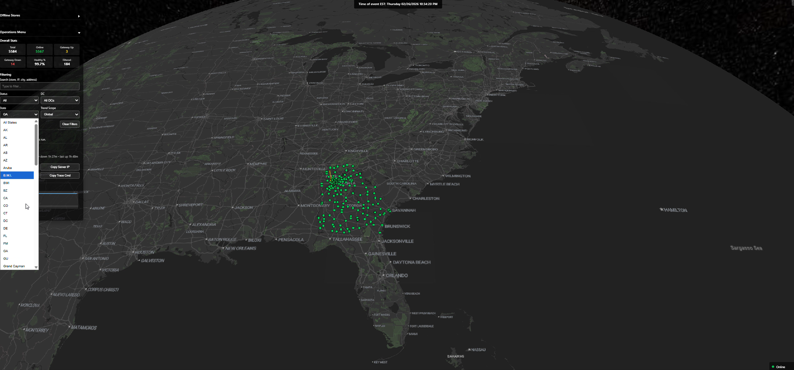
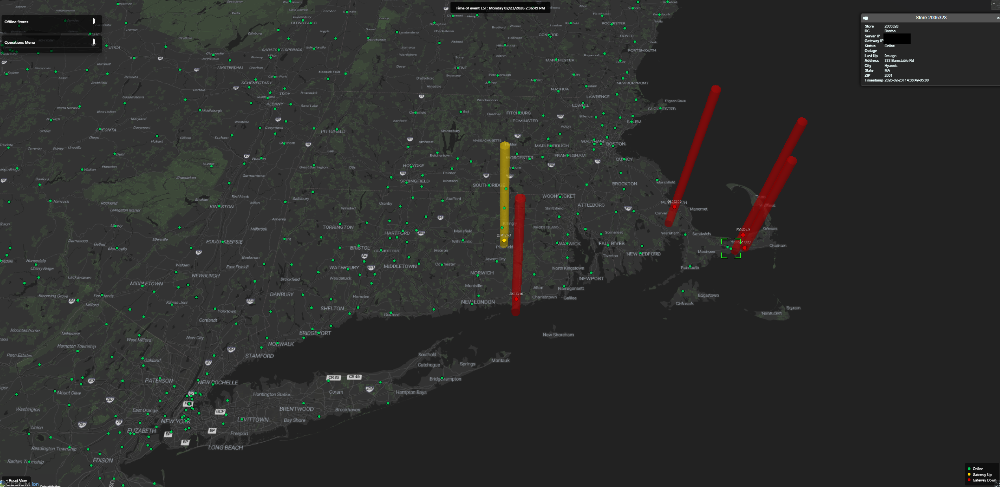
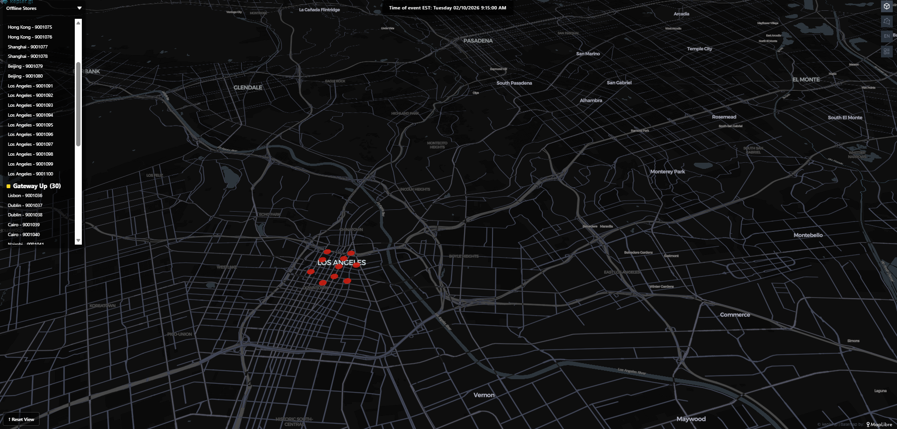
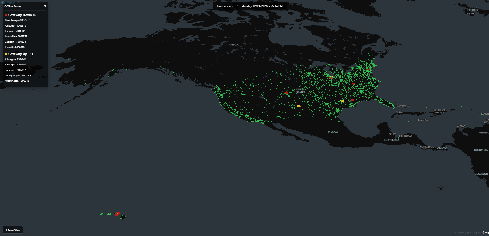

## Sauron 

## Dashboard Examples

<p>
   <strong>State filter (operations menu search)</strong><br/>
   Single still image showing a state being searched for in the operations menu.
</p>

<p>
   
</p>

<p>
   <strong>ISP outage (real-time still)</strong><br/>
   Single still image showing an ISP outage in real time.
</p>

<p>
   
</p>

<p>
   <strong>Live run change (map update)</strong><br/>
   GIF showing the map updating live during a run.
</p>

<p>
   
</p>

<p>
   <strong>Locator (offline stores across states)</strong><br/>
   GIF showing the visual moving state to state using the offline stores menu.
</p>

<p>
   
</p>

<p>
   <strong>Outage view (local/regional disruption)</strong><br/>
   Demonstrates what a localized outage can look like across a cluster (e.g., natural disaster or local ISP interruption).
</p>

<p>
   
</p>

<p>
   <strong>Real scan (live environment)</strong><br/>
   Shows the tool scanning ~6,000 sites in real time.
</p>

<p>
   
</p>

<p>
   <strong>Reset view (ease-of-use)</strong><br/>
   Quick way to zoom the map all the way back out.
</p>

<p>
   
</p>

## What You're Looking At

This repo contains:
- **map_ui_hub.html** — Multi-map launcher (Cesium, MapLibre, Kepler)
- **cesium_map.html / maplibre_map.html / kepler_map.html** — Public demo map UIs
- **sample_data/map_status_sample.json** — Sample scan results (green ✓, yellow ⚠, red ✗ statuses)
- **sauron.py** — Scanner tool (simplified demo version showing CLI interface)

Provide your own `sites.csv` and optional `DC_LIST.csv`.

## Quick Start (Demo Mode)

## View the Dashboard

1. **Start a local web server** in this folder:
   ```bash
   # Windows
   cd path\to\sauron-presentation
   python -m http.server 8000

   # Linux/macOS
   cd path/to/sauron-presentation
   python -m http.server 8000
   ```

2. **Open your browser** to:
   ```
   http://localhost:8000/map_ui_hub.html
   ```

3. **You should see:**
   - A geospatial map of the US (Maplibre GL)
   - Color-coded site markers:
     - **Green** = online ✓
     - **Yellow** = server down, gateway up (⚠ network issue)
     - **Red** = fully offline ✗
   - A left-hand panel listing failed sites grouped by status
   - Site details on click (address, last ping time, etc.)

## Run the Scanner (Locally)

To scan your own sites with your data:

1. **Ensure Python 3.10+ is installed:**
   ```bash
   python --version
   ```

2. **Run the scanner:**
   ```bash
   # Windows
   python sauron.py sites.csv

   # Linux/macOS
   python sauron.py sites.csv
   ```

3. **Or with gateway diagnostics:**
   ```bash
   # Windows
   python sauron.py sites.csv --gateway-check

   # Linux/macOS
   python sauron.py sites.csv --gateway-check
   ```

4. **Output files appear in `./logs/map_status_latest.json`**

## Required CSV Headers
`sites.csv` must include:
- `siteNumber`
- `IPAddress`

Optional (recommended):
- `Gateway`, `Latitude`, `Longitude`, `Address`, `City`, `State`, `ZIP`

## Customizing the Demo

## Update the Sample Data

Replace `sample_data/map_status_sample.json` with your own sanitized scan results:

```bash
# Run a real scan in your private environment
python sauron.py your_sites.csv --gateway-check --output-dir ./logs

# Build a public-safe feed (redacts IPs/DC names/site ids/locations)
# Windows / Linux / macOS
python scripts/sanitize_public_feed.py --input logs/map_status_latest.json --output sample_data/map_status_sample.json --run-id public-demo

# Reload the browser — dashboard updates automatically
```

## Safe Public Release Workflow

1. Run scanner in private environment only (`sites.csv`, `DC_LIST.csv`, `logs/` are not committed).
2. Generate sanitized demo feed:
   ```bash
   python scripts/sanitize_public_feed.py
   ```
3. Validate no sensitive indicators before push:
   ```bash
   python scripts/privacy_guard.py
   ```
4. Commit only public assets (dashboard HTML, sample data, docs, GIFs/screenshots).

GitHub Actions also runs the same privacy guard in `.github/workflows/privacy-guard.yml` on every push/PR.

## Modify Dashboard Styling

Edit `map_ui_hub.html` (launcher) and the individual map pages to adjust:
- **Color scheme** — change RGB values for green/yellow/red markers
- **Map center** — default view location (line ~450: `setCenter()`)
- **Popup text** — site information display format
- **Panel layout** — left-hand offline list appearance

### Sample Data Structure

Format your JSON feed like `sample_data/map_status_sample.json`:

```json
[
  {
      "timestamp": "2026-02-09T12:00:00-05:00",
      "run_id": "demo-1",
      "site": "SITE-0001",
      "dc_code": "DC01",
      "dc_name": "Region 01",
      "server_ip": "198.51.100.10",
      "gateway_ip": "198.51.100.1",
    "server_up": true,
    "gateway_up": true,
    "status": "green",
    "status_code": 0,
      "Latitude": 0.0,
      "Longitude": 0.0,
      "City": "Example City",
      "State": "CA"
  }
]
```

- **Pre-scan before the meeting:** Run `python sauron.py sites.csv --gateway-check` to generate fresh data (5-10 minutes for typical network)
- **Use `--max-workers 500` to speed up large scans** (completes sooner)
- **Export the map:** Use browser's screenshot or developer tools to capture dashboard for slides
- **Show the offline panel:** Click a failed site to highlight it on the map — demonstrates geo-centric triage
- **Highlight the yellow group:** Shows how the tool distinguishes server failures (red) from network problems (yellow)

## Key Points

| Feature | Value |
|---------|-------|
| **Speed** | 5,000+ sites in 2–5 minutes (parallelized) |
| **Accuracy** | Dual-check (ping + retry on timeout) |
| **Intelligence** | Distinguishes hardware failure from network outage |
| **Visibility** | Geo-centric dashboard: pinpoint affected regions instantly |
| **Integration** | JSON + CSV outputs for Power BI, Tableau, custom dashboards |
| **Lightweight** | Runs on any OS (Windows/Linux); Python only; no external dependencies |

## Example Paths 
Use these placeholders instead of real machine paths:

```text
Windows:
   path\to\sauron-presentation\
   path\to\sauron-presentation\logs\

Linux/macOS:
   path/to/sauron-presentation/
   path/to/sauron-presentation/logs/
```

## CLI Flags
```
sites_csv                 Path to sites CSV (default: sites.csv)
--dc-csv CSV_FILE          Path to DC list CSV (default: DC_LIST.csv)
--gateway-check            Enable gateway connectivity checks
--retry-pings N            Number of retries per failure (default: 3)
--timeout-ms MS            Ping timeout in milliseconds (default: 1000)
--max-workers N            Number of parallel ping threads (default: 200)
--output-dir PATH          Directory for logs/results (default: ./logs)
--publish-dir PATH         Where to publish live feed files (default: output dir)
--run-id ID                Custom run identifier (default: timestamp)
--write-txt                Export failure details as text report
--write-csv                Export failure details as CSV
--quiet                    Reduce console output
--zip-run                  Compress the run folder when complete
--remove-run-folder-after-zip  Delete run folder after zip
--loop                     Run continuously
--interval-seconds N       Loop sleep interval in seconds (default: 100)
--help                     Show all options
```
